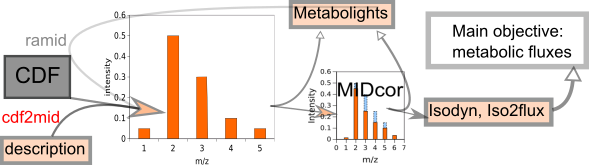

# cdf2MID
Version: 1.0

## Short description
R-program to extract mass isotopomer distributions (MID) of 13C-labeled metabolites from raw experimental time course recordings of mass spectra.

## Description
Cdf2MID is a computer program designed to primary process of 13C mass isotopomer data obtained with GCMS and initiate a workflow of a comprehensive data analysis. It reads the files generated by mass spectrometers and saved in netCDF format, containing registered time course of m/z chromatograms. It evaluates the MID at the moment when peaks are reached, and saves the obtained information in a form facilitating including it in the database Metabolights, and further correcting for natural isotope occurrence.
Cdf2MID is written in 'R', its code can be found in https://github.com/seliv55/cdf2mid. It uses library “ncdf4” to read netCDF files, and analyze and visualize the spectra that they contain. To perform its function, in addition to a collection of CDF files Cdf2MID needs some additional information, such as retention times and m/z values of metabolites of interest. This additional information can be provided in the most simple form in a text file.


## Key features
- primary processing of 13C mass isotopomer data obtained with GCMS

## Functionality
- Preprocessing of raw data
- initiation of workflows of the data analysis

## Approaches
- Isotopic Labeling Analysis / 13C
    
## Instrument Data Types
- MS

## Data Analysis
cdf2MID reads the CDF files presented in the working directory, and then
- separates the time courses for selected m/z peaks corresponding to specific mass isotopomers;
- corrects baseline for each selected mz;
- choses the time points where the distribution of peaks is less contaminated by other compounds and thus is the most representative of the real analyzed distribution of mass isotopomers;
- evaluates this distribution, and saves it in files readable by MIDcor, a program, which performs the next step of analysis, i.e. correction of the RaMID spectra for natural isotope occurrence, which is necessary to perform a fluxomic analysis.

## Tool Authors
- Vitaly Selivanov (Universitat de Barcelona)

## Container Contributors
- [Pablo Moreno](EBI)

## Website
- https://github.com/seliv55/cdf2mid

## Git Repository
- https://github.com/seliv55/cdf2mid

## Installation

- As independent program, cdf2mid itself does not require installation.  There are two ways of using it: either creating a library "cdf2mid", or reading source files containing the implemented functions. Standing in the cdf2mid directory:

- 1) Create a library of functions:
   
```
 sudo R

 library(devtools)
 
 build() 
 
 install() 
 
 library(cdf2mid) 
 
 library(ncdf4)
```

- 2) read directly the necessary functions:
  
```
 R 
 
 source("R/cdf2mid.R") 
 
 source("R/libcdf.R") 
 
 library(ncdf4)
```

## Usage Instructions

- The main function( metan(infile, cdfdir, outfile) ) takes three parameters. The first one, infile (default value "simetdat") is a name of file with additional information (e.g. retention time, m/z interval for the metabolites of interest). The second, cdfdir (default value "wd/"), is a path to a directory, containing the netCDF files desidned for the analysis. The third, outfile  (default value "cdf2midout.csv"), is the name of output file with the obtained results.

```
 metan(infile, cdfdir, outfile)
```
 
## An example provided

- The file "simetdat" is an example of the information that has to be provided in addition to the netCDF files. This information is necessary for further analysis. table keeping the format accepted as exchangeable with the Metabolights database. Currently it content is:
    
Name       RT     mz0   Fragment  Formula        control

Citrate   37.5    459     C1-C6   C20H39O6Si3     459

Aspartate 28.5    418     C1-C4   C18H40O4N1Si3   418

Malate    27.2    419     C1-C4   C18H39O5Si3     419

Glucose   3.74    328     C1-C6   C14H18O8N1      328

Glutamate2-4 3.79 152     C2-C4   C5H5O1N1F3      152

Glutamate2-5 3.79 198     C2-C5   C6H7O3N1F3      198

Lactate   5.33    328     C1-C3   C10H13O3N1F7    328

Ribose    5.28    256     C1-C5   C11H14O6N1      256

The first column indicates the names of metabolites of interest, the second column corresponding retention times in minutes, the third is the m/z value for the lightest isotopomer of the desired fragments, whos carbons originated from the initial molecule, and the formula of whole derivate are shown in the next two columns. Gas chromatography technique often produces several fragments ot the same derivated metabolite. The last column shows m/z value of the lightest isotopomer of another fragment of the same metabolite, which serves as a ccontrol that the given metabolite was indeed detected. However, since in the presented example only one fragment of each metabolite was registered, here the last column just repeats the third column. 

Based on this information cdf2mid extracts raw MID from the netCDF files presented in cdfdir, and creates tables of data saved in outfile. Such tables are accepted as exchangeable with Metabolights database.


- Run this example using the command:

```
  metan(infile="simetdat",cdfdir="wd/",outfile="cdf2midout.csv")
```

The file containing the results provided by cdf2mid (here "cdf2midout.csv") can proceed for further correction by MIDcor (https://github.com/seliv55/midcor).

