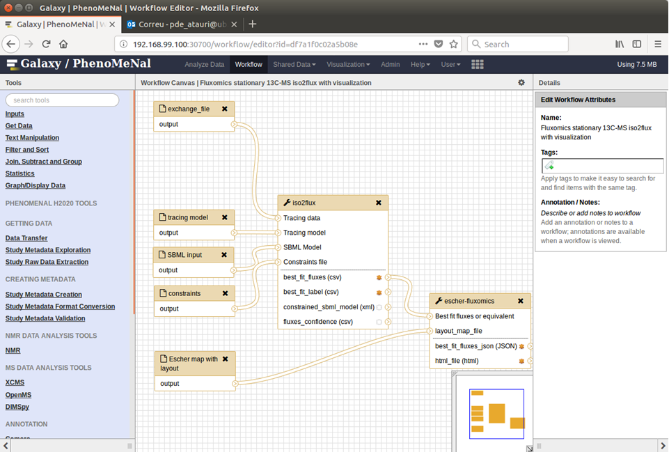

By <strong>Carles Foguet</strong>, <strong>Effrosyni Karakitsou</strong>, <strong>Pedro de Atauri</strong> and <strong>Marta Cascante</strong> (last updated: 2018-07-28)

The following table contains case studies from literature and databases <a href="https://www.ncbi.nlm.nih.gov/pubmed/25731751" rel="nofollow">13C tracer data based on mass spectrometry</a>, which are applied for estimation of internal fluxes according to the principles of <a href="https://www.ncbi.nlm.nih.gov/pubmed/25531408" rel="nofollow">13C Metabolic Flux Analysis</a> (13C-MFA). Each case corresponds to our free interpretation and adaptation of the data provided by the original authors. The different case-studies are organized around three models of central metabolism:
 
<ul>
<li><b>1</b>. <a href="https://drive.google.com/drive/folders/13a0VDoymKXKzl3HTMrnf_NSYPmwqLDaF" rel="nofollow">Mammals</a> (human and hamster). </li>
<li><b>2</b>. <a href="https://drive.google.com/drive/folders/1bizVrRsqZ8oei-w7TGIJCpcmVsuK_qx3" rel="nofollow">Yeast</a> (<i>Sacharomyces cerevisiae</i>).</li>
<li><b>3</b>. <a href="https://drive.google.com/drive/folders/1lK3PE4vXsKxYvvnlE8HbuxJH3m2EVVrR" rel="nofollow">Bacteria</a> (<i>Escherichia coli</i>).</li>
</ul>

These models are provided as templates to be used in new analyses. They follow the nomenclature conventions in the <a href="http://bigg.ucsd.edu/" rel="nofollow">BIGG Models</a> data base for genome-scale models: <a href="https://www.ncbi.nlm.nih.gov/pubmed/?term=29457794">Recon3D</a> for human; <a href="https://www.ncbi.nlm.nih.gov/pubmed/?term=27883890">iCHOv1</a> for hamster; <a href="https://www.ncbi.nlm.nih.gov/pubmed/?term=19321003">iMM904</a> for <i>Sacharomyces cerevisiae</i>; and <a href="https://www.ncbi.nlm.nih.gov/pubmed/?term=29020004">iML1515</a> for <i>Escherichia coli</i></b>. This permits the integration of 13C-MFA studies with genome-scale models, by adding the results of 13C-MFA as flux constraints to genome-scale metabolic models.
 

<table width="100%" border="1" cellpadding="2" cellspacing="2" style="font-family:Georgia, Garamond, Serif; font-size:11px; color:blue;fontstyle:italic; border-color: #BCBCBC; border-style: solid; background-color: #ccffff;">
  <tr><!-- Row 1 -->
     <th style="border-color : #BCBCBC #BCBCBC #BCBCBC #BCBCBC; border-style: solid; background-color: #727EBC;" align="center" >Reference</th><!-- Col 1 -->
	 <th style="border-color : #BCBCBC #BCBCBC #BCBCBC #BCBCBC; border-style: solid; background-color: #727EBC;" align="center" ></th><!-- Col 2 -->
     <th style="border-color : #BCBCBC #BCBCBC #BCBCBC #BCBCBC; border-style: solid; background-color: #727EBC;" align="center" >Organism/Tissue/Cell line</th><!-- Col 3 -->
     <th style="border-color : #BCBCBC #BCBCBC #BCBCBC #BCBCBC; border-style: solid; background-color: #727EBC;" align="center" >13C data</th><!-- Col 7 -->
     <th style="border-color : #BCBCBC #BCBCBC #BCBCBC #BCBCBC; border-style: solid; background-color: #727EBC;" align="center" >Labelled substrates</th><!-- Col 8 -->
     <th style="border-color : #BCBCBC #BCBCBC #BCBCBC #BCBCBC; border-style: solid; background-color: #727EBC;" align="center" >Labelled products</th><!-- Col 9 -->
     <th style="border-color : #BCBCBC #BCBCBC #BCBCBC #BCBCBC; border-style: solid; background-color: #727EBC;" align="center" >Required input files</th><!-- Col 11 -->
  </tr>
  <tr><!-- Row 2 -->
     <td style="border-color : #BCBCBC #BCBCBC #BCBCBC #BCBCBC; border-style: solid; background-color: #ccffff;" align="center" ><a href="https://www.ebi.ac.uk/metabolights/MTBLS412">Metabolights MTBLS412</a></td><!-- Col 1 -->
     <td style="border-color : #BCBCBC #BCBCBC #BCBCBC #BCBCBC; border-style: solid; background-color: #ccffff;" align="center" >-</td><!-- Col 2 -->
     <td style="border-color : #BCBCBC #BCBCBC #BCBCBC #BCBCBC; border-style: solid; background-color: #ccffff;" align="center" >Human HUVEC cells (hypoxia)</td><!-- Col 3 -->
     <td style="border-color : #BCBCBC #BCBCBC #BCBCBC #BCBCBC; border-style: solid; background-color: #ccffff;" align="center" >Raw data</td><!-- Col 6 -->
     <td style="border-color : #BCBCBC #BCBCBC #BCBCBC #BCBCBC; border-style: solid; background-color: #ccffff;" align="center" >[1,2-13C2]-Glc</td><!-- Col 7 -->
     <td style="border-color : #BCBCBC #BCBCBC #BCBCBC #BCBCBC; border-style: solid; background-color: #ccffff;" align="center" >Rib, Glycogen, Lac</td><!-- Col 8 -->
     <td style="border-color : #BCBCBC #BCBCBC #BCBCBC #BCBCBC; border-style: solid; background-color: #ccffff;" align="center" ><a href="https://drive.google.com/open?id=1wgDj6RQQriLlz136RoQrw5H94yUoiRFf">files</a></td><!-- Col 10 -->
  </tr>
  <tr><!-- Row 3 -->
     <td style="border-color : #BCBCBC #BCBCBC #BCBCBC #BCBCBC; border-style: solid; background-color: #ccffff;" align="center" ><a href="https://www.ncbi.nlm.nih.gov/pubmed/?term=27049945">PMID27049945</a></td><!-- Col 1 -->
     <td style="border-color : #BCBCBC #BCBCBC #BCBCBC #BCBCBC; border-style: solid; background-color: #ccffff;" align="center" ><a href="https://doi.org/10.1038/nature17393">doi</a></td><!-- Col 2 -->
     <td style="border-color : #BCBCBC #BCBCBC #BCBCBC #BCBCBC; border-style: solid; background-color: #ccffff;" align="center" >Human H460 lung cancer cells (Spheriod)</td><!-- Col 3 -->
     <td style="border-color : #BCBCBC #BCBCBC #BCBCBC #BCBCBC; border-style: solid; background-color: #ccffff;" align="center" >Corrected data</td><!-- Col 8 -->
     <td style="border-color : #BCBCBC #BCBCBC #BCBCBC #BCBCBC; border-style: solid; background-color: #ccffff;" align="center" >[1-13C1]-Gln, [5-13C1]-Gln, [U-13C5]-Gln, [U-13C6]-Glc</td><!-- Col 6 -->
     <td style="border-color : #BCBCBC #BCBCBC #BCBCBC #BCBCBC; border-style: solid; background-color: #ccffff;" align="center" >Cit, Glu, Fum, Mal, Asp, Palm</td><!-- Col 7 -->
     <td style="border-color : #BCBCBC #BCBCBC #BCBCBC #BCBCBC; border-style: solid; background-color: #ccffff;" align="center" ><a href="https://drive.google.com/drive/folders/1Z3xCneUOY1fATEtGE-AEScmgYDwKHi5b">files</a></td><!-- Col 10 -->
  </tr>
  <tr><!-- Row 4 -->
     <td style="border-color : #BCBCBC #BCBCBC #BCBCBC #BCBCBC; border-style: solid; background-color: #ccffff;" align="center" ><a href="https://www.ncbi.nlm.nih.gov/pubmed/?term=27110360">PMID27110360</a></td><!-- Col 1 -->
     <td style="border-color : #BCBCBC #BCBCBC #BCBCBC #BCBCBC; border-style: solid; background-color: #ccffff;" align="center" ><a href="https://doi.org/10.1186/s40170-016-0150-z">doi</a></td><!-- Col 2 -->
     <td style="border-color : #BCBCBC #BCBCBC #BCBCBC #BCBCBC; border-style: solid; background-color: #ccffff;" align="center" >Human lung adenocarcinoma A549 cells (21%O2)</td><!-- Col 3 -->
     <td style="border-color : #BCBCBC #BCBCBC #BCBCBC #BCBCBC; border-style: solid; background-color: #ccffff;" align="center" >Corrected data</td><!-- Col 8 -->
     <td style="border-color : #BCBCBC #BCBCBC #BCBCBC #BCBCBC; border-style: solid; background-color: #ccffff;" align="center" >[1,2-13C2]-Glc, [U-13C5]-Gln</td><!-- Col 6 -->
     <td style="border-color : #BCBCBC #BCBCBC #BCBCBC #BCBCBC; border-style: solid; background-color: #ccffff;" align="center" >Mal, N-acetyl-Asp, Cit, AMP, Glu</td><!-- Col 7 -->
     <td style="border-color : #BCBCBC #BCBCBC #BCBCBC #BCBCBC; border-style: solid; background-color: #ccffff;" align="center" ><a href="https://drive.google.com/open?id=1ThkUg3Ib7bAQmq8zqp-WP_w94C5_PP79">files</a></td><!-- Col 9 -->
  </tr>
  <tr><!-- Row 5 -->
     <td style="border-color : #BCBCBC #BCBCBC #BCBCBC #BCBCBC; border-style: solid; background-color: #ccffff;" align="center" ><a href="https://www.ncbi.nlm.nih.gov/pubmed/?term=27379180">PMID27379180</a></td><!-- Col 1 -->
     <td style="border-color : #BCBCBC #BCBCBC #BCBCBC #BCBCBC; border-style: solid; background-color: #ccffff;" align="center" ><a href="https://doi.org/10.1186/s40170-016-0153-9">doi</a></td><!-- Col 2 -->
     <td style="border-color : #BCBCBC #BCBCBC #BCBCBC #BCBCBC; border-style: solid; background-color: #ccffff;" align="center" >Human pancreatic ductal adenocarcinoma PANC1 cell line
 (TNF-alpha)</td><!-- Col 3 -->
     <td style="border-color : #BCBCBC #BCBCBC #BCBCBC #BCBCBC; border-style: solid; background-color: #ccffff;" align="center" >Corrected data</td><!-- Col 8 -->
     <td style="border-color : #BCBCBC #BCBCBC #BCBCBC #BCBCBC; border-style: solid; background-color: #ccffff;" align="center" >[U-13C6]-Glc</td><!-- Col 6 -->
     <td style="border-color : #BCBCBC #BCBCBC #BCBCBC #BCBCBC; border-style: solid; background-color: #ccffff;" align="center" >Pyr, Cit</td><!-- Col 7 -->
     <td style="border-color : #BCBCBC #BCBCBC #BCBCBC #BCBCBC; border-style: solid; background-color: #ccffff;" align="center" ><a href="https://drive.google.com/drive/folders/1li1rB7UOlLURdCV_J-1FyOBKSDsaspgD">files</a></td><!-- Col 9 -->
  </tr>
  <tr><!-- Row 6 -->
     <td style="border-color : #BCBCBC #BCBCBC #BCBCBC #BCBCBC; border-style: solid; background-color: #ccffff;" align="center" ><a href="https://www.ncbi.nlm.nih.gov/pubmed/?term=24773761">PMID24773761</a></td><!-- Col 1 -->
     <td style="border-color : #BCBCBC #BCBCBC #BCBCBC #BCBCBC; border-style: solid; background-color: #ccffff;" align="center" ><a href="https://doi.org/10.1186/1752-0509-8-50">doi</a></td><!-- Col 2 -->
     <td style="border-color : #BCBCBC #BCBCBC #BCBCBC #BCBCBC; border-style: solid; background-color: #ccffff;" align="center" >Cricetulus griseus CHO-K1 cell line (Compartimentation)</td><!-- Col 3 -->
     <td style="border-color : #BCBCBC #BCBCBC #BCBCBC #BCBCBC; border-style: solid; background-color: #ccffff;" align="center" >Corrected data</td><!-- Col 8 -->
     <td style="border-color : #BCBCBC #BCBCBC #BCBCBC #BCBCBC; border-style: solid; background-color: #ccffff;" align="center" >[U-13C6]-Glc</td><!-- Col 6 -->
     <td style="border-color : #BCBCBC #BCBCBC #BCBCBC #BCBCBC; border-style: solid; background-color: #ccffff;" align="center" >Lac, Ala, Asp, Glu, Gln, Gly, Ser, Pyr</td><!-- Col 7 -->
     <td style="border-color : #BCBCBC #BCBCBC #BCBCBC #BCBCBC; border-style: solid; background-color: #ccffff;" align="center" ><a href="https://drive.google.com/drive/folders/1BIHB9zvMZ7xSvXZv1Wa0T4Ad6-bn-O0X">files</a></td><!-- Col 9 -->
  </tr>
  <tr><!-- Row 7 -->
     <td style="border-color : #BCBCBC #BCBCBC #BCBCBC #BCBCBC; border-style: solid; background-color: #ccffff;" align="center" ><a href="https://www.ncbi.nlm.nih.gov/pubmed/?term=27761435">PMID27761435</a></td><!-- Col 1 -->
     <td style="border-color : #BCBCBC #BCBCBC #BCBCBC #BCBCBC; border-style: solid; background-color: #ccffff;" align="center" ><a href="https://doi.org/10.3389/fbioe.2016.00076">doi</a></td><!-- Col 2 -->
     <td style="border-color : #BCBCBC #BCBCBC #BCBCBC #BCBCBC; border-style: solid; background-color: #ccffff;" align="center" >Saccharomyces cerevisiae WRY2 (Base strain - glucose)</td><!-- Col 3 -->
     <td style="border-color : #BCBCBC #BCBCBC #BCBCBC #BCBCBC; border-style: solid; background-color: #ccffff;" align="center" >Corrected data</td><!-- Col 8 -->
     <td style="border-color : #BCBCBC #BCBCBC #BCBCBC #BCBCBC; border-style: solid; background-color: #ccffff;" align="center" >[1-13C1]-Glc/[U-13C6]-Glc</td><!-- Col 6 -->
     <td style="border-color : #BCBCBC #BCBCBC #BCBCBC #BCBCBC; border-style: solid; background-color: #ccffff;" align="center" >Glycine, Ala, Val, Thr, Leu, Ile, Asp, Asn, Glu, Gln, Arg, Phe, Tyr</td><!-- Col 7 -->
     <td style="border-color : #BCBCBC #BCBCBC #BCBCBC #BCBCBC; border-style: solid; background-color: #ccffff;" align="center" ><a href="https://drive.google.com/drive/folders/1-iVQSKSUOYygrWwbznUt5gUtwwaJ9WfF">files</a></td><!-- Col 9 -->
  </tr>
  <tr><!-- Row 8 -->
     <td style="border-color : #BCBCBC #BCBCBC #BCBCBC #BCBCBC; border-style: solid; background-color: #ccffff;" align="center" ><a href="https://www.ncbi.nlm.nih.gov/pubmed/?term=12603321">PMID12603321</a></td><!-- Col 1 -->
     <td style="border-color : #BCBCBC #BCBCBC #BCBCBC #BCBCBC; border-style: solid; background-color: #ccffff;" align="center" ><a href="https://doi.org/10.1046/j.1432-1033.2003.03448.x">doi</a></td><!-- Col 2 -->
     <td style="border-color : #BCBCBC #BCBCBC #BCBCBC #BCBCBC; border-style: solid; background-color: #ccffff;" align="center" >Escherichia coli K12 MG1655 (Wild-type)</td><!-- Col 3 -->
     <td style="border-color : #BCBCBC #BCBCBC #BCBCBC #BCBCBC; border-style: solid; background-color: #ccffff;" align="center" >Corrected data</td><!-- Col 8 -->
     <td style="border-color : #BCBCBC #BCBCBC #BCBCBC #BCBCBC; border-style: solid; background-color: #ccffff;" align="center" >[1-13C1]-Glc, [U-13C6]-Glc</td><!-- Col 6 -->
     <td style="border-color : #BCBCBC #BCBCBC #BCBCBC #BCBCBC; border-style: solid; background-color: #ccffff;" align="center" >Ser, Pyr, OAA, PEP, a-KG, Gly</td><!-- Col 7 -->
     <td style="border-color : #BCBCBC #BCBCBC #BCBCBC #BCBCBC; border-style: solid; background-color: #ccffff;" align="center" ><a href="https://drive.google.com/drive/folders/1P-jDvwLVjo14NwU-K8M8z3izhBKvI7c_">files</a></td><!-- Col 9 -->
  </tr>
  <tr><!-- Row 9 -->
     <td style="border-color : #BCBCBC #BCBCBC #BCBCBC #BCBCBC; border-style: solid; background-color: #ccffff;" align="center" ><a href="https://www.ncbi.nlm.nih.gov/pubmed/?term=29142823">PMID29142823</a></td><!-- Col 1 -->
     <td style="border-color : #BCBCBC #BCBCBC #BCBCBC #BCBCBC; border-style: solid; background-color: #ccffff;" align="center" ><a href="https://doi.org/10.1016/j.meteno.2016.06.001">doi</a></td><!-- Col 2 -->
     <td style="border-color : #BCBCBC #BCBCBC #BCBCBC #BCBCBC; border-style: solid; background-color: #ccffff;" align="center" >Escherichia coli K12 MG1655 ([0:8:2])</td><!-- Col 3 -->
     <td style="border-color : #BCBCBC #BCBCBC #BCBCBC #BCBCBC; border-style: solid; background-color: #ccffff;" align="center" >Corrected data</td><!-- Col 8 -->
     <td style="border-color : #BCBCBC #BCBCBC #BCBCBC #BCBCBC; border-style: solid; background-color: #ccffff;" align="center" >[1-13C1]-Glc/[U-13C6]-Glc</td><!-- Col 6 -->
     <td style="border-color : #BCBCBC #BCBCBC #BCBCBC #BCBCBC; border-style: solid; background-color: #ccffff;" align="center" >Ala, Asp, Iso, Phe, Ser, Thr, Tyr, Val</td><!-- Col 7 -->
     <td style="border-color : #BCBCBC #BCBCBC #BCBCBC #BCBCBC; border-style: solid; background-color: #ccffff;" align="center" ><a href="https://drive.google.com/drive/folders/1NMrvs90sX6Gh7A7NpaiRS-Xn5vd2w_a7">files</a></td><!-- Col 9 -->
  </tr>
  <tr><!-- Row 10 -->
     <td style="border-color : #BCBCBC #BCBCBC #BCBCBC #BCBCBC; border-style: solid; background-color: #ccffff;" align="center" ><a href="https://www.ncbi.nlm.nih.gov/pubmed/?term=24957033">PMID24957033</a></td><!-- Col 1 -->
     <td style="border-color : #BCBCBC #BCBCBC #BCBCBC #BCBCBC; border-style: solid; background-color: #ccffff;" align="center" ><a href="https://doi.org/10.3390/metabo4020408">doi</a></td><!-- Col 2 -->
     <td style="border-color : #BCBCBC #BCBCBC #BCBCBC #BCBCBC; border-style: solid; background-color: #ccffff;" align="center" >Escherichia coli K12 MG1655 (FAAs)</td><!-- Col 3 -->
     <td style="border-color : #BCBCBC #BCBCBC #BCBCBC #BCBCBC; border-style: solid; background-color: #ccffff;" align="center" >Corrected data</td><!-- Col 8 -->
     <td style="border-color : #BCBCBC #BCBCBC #BCBCBC #BCBCBC; border-style: solid; background-color: #ccffff;" align="center" >[1-13C1]-Glc/[U-13C6]-Glc</td><!-- Col 6 -->
     <td style="border-color : #BCBCBC #BCBCBC #BCBCBC #BCBCBC; border-style: solid; background-color: #ccffff;" align="center" >Ala, Asp, Glu, Gly, Leu, Phe, Thr, Tyr, Val</td><!-- Col 7 -->
     <td style="border-color : #BCBCBC #BCBCBC #BCBCBC #BCBCBC; border-style: solid; background-color: #ccffff;" align="center" ><a href="https://drive.google.com/drive/folders/1xGmWc_6Hnb20JaQIjmddRaBcvd1CvPFx">files</a></td><!-- Col 9 -->
  </tr>
</table>

The files required to run each example in the workflow for fluxomics are provided in the last column. There are several possible workflows depending on the selected combination of programs. Among them, two ways of applying the workflow for fluxomics:

<ul>
<li>Starting with <b>raw data</b>. This corresponds to the <a href="https://github.com/phnmnl/phenomenal-h2020/wiki/fluxomics-workflow">provided tutorial</a> and includes a complete analysis using <i>Ramid</i>, <i>Midcor</i>, <i>Iso2flux</i> and <i>escher-fluxomics</i>.</li>
<li>Starting with <b>corrected data</b> obtained from literature. The applications of <i>Ramid</i> and <i>Midcor</i> are not required, and the workflow must be edited to be like this:</li>
</ul>

For visualizations of the maps of central metabolism, <i>escher-fluxomics</i> take advantage of the web-based tool <a href="https://escher.github.io/">Escher</a> and maps available in the <a href="https://github.com/escher/community-maps/">community-maps repository for Escher</a>.
 

<i>Iso2flux</i> is based on a heuristic optimization and, accordingly, complex systems as those presented here might require to run several times the workflow with <i>Iso2flux</i> until a succesful fitting is obtained

<h2>
<a id="user-content-4-acknowledgements" class="anchor" href="https://github.com/phnmnl/phenomenal-h2020/wiki/fluxomics-workflow#4-acknowledgements" aria-hidden="true"><svg class="octicon octicon-link" viewBox="0 0 16 16" version="1.1" width="16" height="16" aria-hidden="true"><path fill-rule="evenodd" d="M4 9h1v1H4c-1.5 0-3-1.69-3-3.5S2.55 3 4 3h4c1.45 0 3 1.69 3 3.5 0 1.41-.91 2.72-2 3.25V8.59c.58-.45 1-1.27 1-2.09C10 5.22 8.98 4 8 4H4c-.98 0-2 1.22-2 2.5S3 9 4 9zm9-3h-1v1h1c1 0 2 1.22 2 2.5S13.98 12 13 12H9c-.98 0-2-1.22-2-2.5 0-.83.42-1.64 1-2.09V6.25c-1.09.53-2 1.84-2 3.25C6 11.31 7.55 13 9 13h4c1.45 0 3-1.69 3-3.5S14.5 6 13 6z"></path></svg></a>Acknowledgements</h2>

<strong>Carles Foguet</strong>, <strong>Effrosyni Karakitsou</strong>, <strong>Pedro de Atauri</strong> and <strong>Marta Cascante</strong> (<a href="https://www.ub.edu" rel="nofollow">Universitat de Barcelona</a>); <strong>Pablo Moreno</strong> and <strong>Namrata Kale</strong> (<a href="https://www.ebi.ac.uk/" rel="nofollow">EMBL-EBI</a>). The data covering these case studies were first collected by <i>Molecular connections</i> and then interpreted and adapted by <strong>Pedro de Atauri</strong>.

